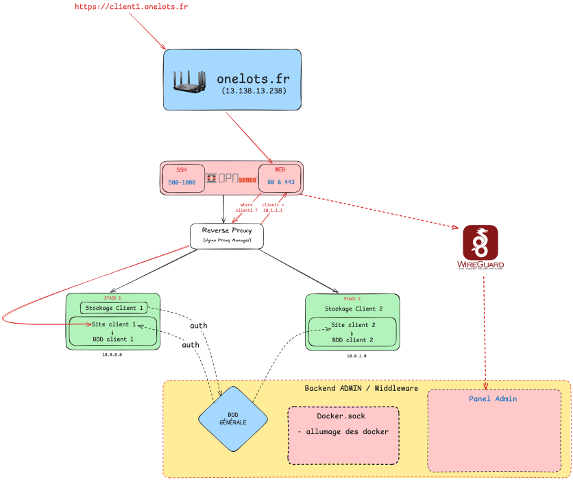

# Fast Automated Protection

## Contexte du projet : 

    - Vous travaillez pour une startup qui vend des prestations de sauvegardes à des clients.
    - A ce titre vous allez créer une infrastructure sécurisée de sauvegardes réseau.
(P.R)

## fonctionnement des sauvegardes

L'équipe technique attribue directement une URL au client, par exemple "http://client1.sauvegarde.fr" puis le client arrive directement sur sa page de connexion grâce au reverse proxy, qui, placé juste devant le serveur web, lui attribue une IP. Depuis l'espace utilisateur, le client peut voir l'état de ses sauvegardes, le stockage restant et les différentes informations relatives à son compte.Dans une zone isolée de l'extérieur on a trois choses :     
    - Panel admin : accessible que par les techniciens via Wireguard 
    - BDD générale : deux authentifications auront lieu ( 1 quand le client va vouloir se connecter à son compte et la deuxième quand en SSH l'authentification pour lancer les sauvegardes aura lieue)
    - Un docker.sock : Allumage des dockers

Il nous reste donc une partie à couvrir, les SAUVERGARDES.

Le script RUN, selon le temps qu'aura défini l'utilisateur, se lance.

## Architecture réseau

Ci-dessous l'infrastructure que nous avons imaginée pour mener à bien le projet :

## Connaissances nécessaires

    - Utilisation de Docker
    - Python

## options

A développer

## Backend Admin

A développer

## Notification

A développer

## sauvegardes chiffrées

A développer

## Alerte

A développer

## récupération des sauvegardes

A développer

