# Fast Automated Protection

    

## Un peu de contexte : 

    - Vous travaillez pour une startup qui vend des prestations de sauvegardes à des clients.
    - A ce titre vous allez créer une infrastructure sécurisée de sauvegardes réseau.
(P.R)

## fonctionnement des sauvegardes

L'équipe technique attribue directement une URL au client, par exemple "http://client1.sauvegarde.fr" puis le client arrive directement sur sa page de connexion grâce au reverse proxy, qui, placé juste devant le serveur web, lui attribue une IP.  
Depuis l'espace utilisateur, le client peut voir l'état de ses sauvegardes, le stockage restant et les différentes informations relatives à son compte. Dans une zone isolée de l'extérieur, on retrouve trois éléments :     
- Panel admin : accessible uniquement par les techniciens via Wireguard   
- BDD générale : deux authentifications auront lieu ( 1 quand le client va vouloir se connecter à son compte et la deuxième quand en SSH l'authentification pour lancer les sauvegardes aura lieue)  
- Un docker.sock : mise en place d'un moyen pour lancer des dockers à distance, qui va permettre de créer un docker par client. Permet également de monter un volume lorsque nécessaire.    

Il nous reste donc une partie à couvrir, les SAUVERGARDES.

Le script RUN, selon le temps qu'aura défini l'utilisateur, se lance.

- nouveau client = nouvelle stack docker bdd / panel 
- api clients ou admins 
- séparation des backends (admin pas atteignable)

## Architecture réseau

Ci-dessous l'infrastructure que nous avons imaginée pour mener à bien le projet :

## Connaissances nécessaires

    - Utilisation de Docker
    - Python
    - FastAPI
    - PostgreSQL
    - Wireguard
    - Docker-compose
    - Nginx
    - Git
    - Connaissances élémentaires en réseau

## options

## Backend Admin

Dans le backend admin on retrouve :

- Une base de données générale, qui permet de vérifier si le mot de passe admin du client est identique à celui renseigné et qui contient également la liste des clients et les "stats" des clients (capacitée de stockage autorisée).
- Le pannel d'aministration qui est utilisé par les administrateurs systèmes l'ensemble des clients et s'assurer que tout fonctionne correctement. 

# Documentation technique.

## Installation

`docker compose up --build` suffit à lancer les services nécessaires.

## Prise en main

### Panel admin

On commence par se diriger vers la page de connection. Pour accéder à celle-ci, il faut demander une configuration wireguard, qui permet d'accéder au panel.  
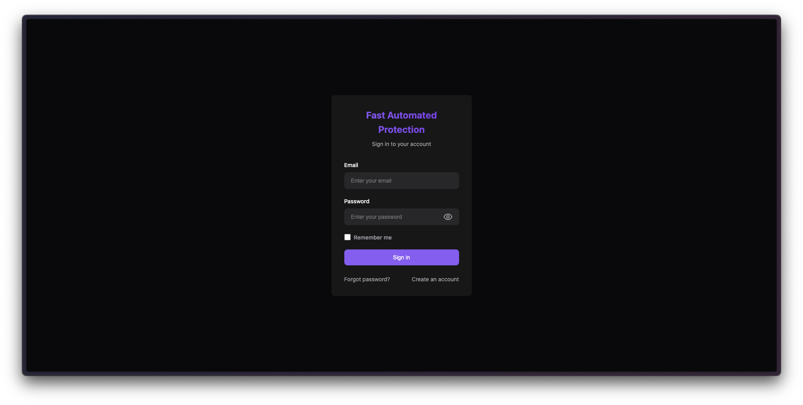

Une fois connecté, on arrive sur la page d'accueil du panel admin.  

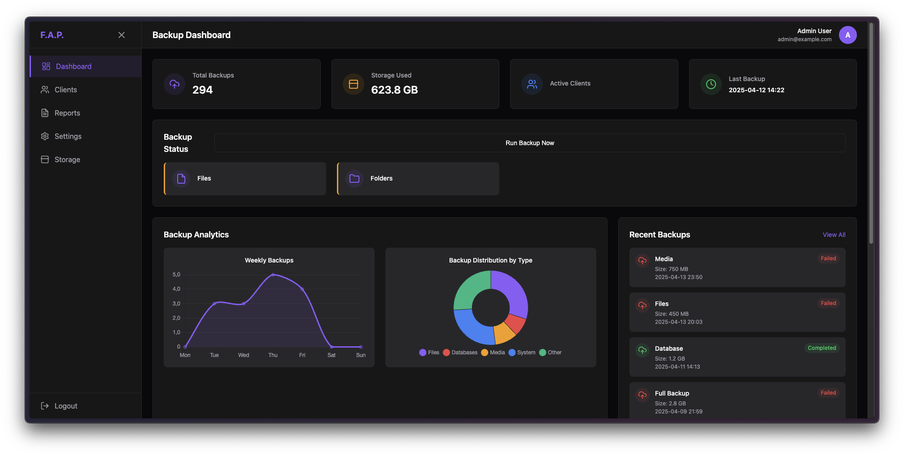

La page en elle-même est assez intuitive, il n'est pas forcément opportun de s'y attarder.  
La création d'un nouvel utilisateur se fait simplement en cliquant sur "utilisateurs" :  

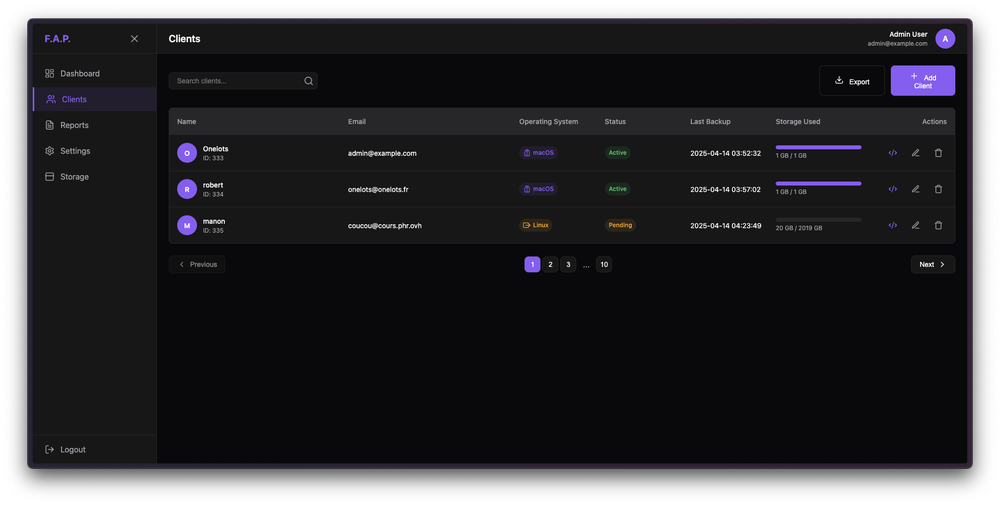

puis "ajouter un utilisateur" :

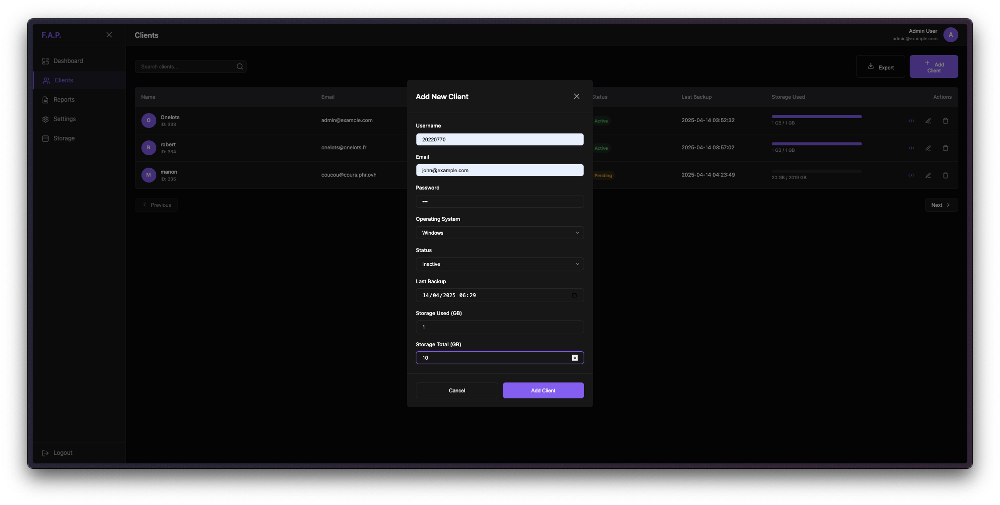

**C'est également là qu'on peut télécharger un script en fonction de l'utilisateur**

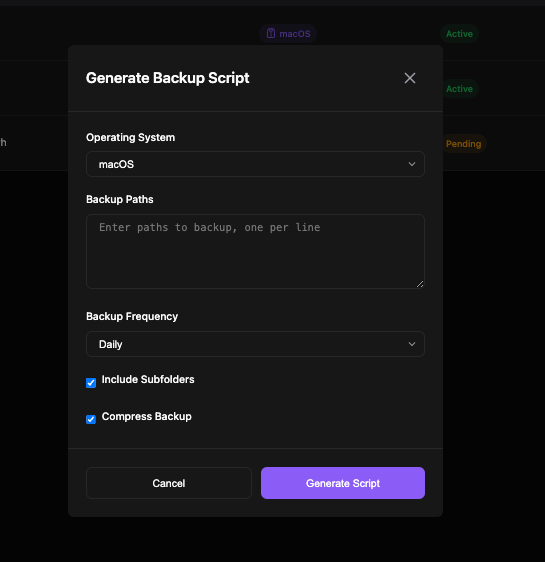

Pour ce faire, nous n'avons qu'à appuyer sur le bouton violet de génération de script, et attendre que la magie opère.

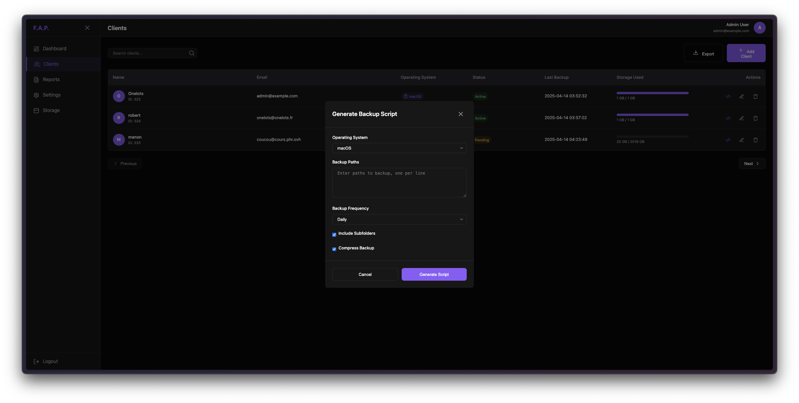

On remarque également que le panel admin nous propose une multitude d'options.  

- On peut voir l'ensemble des utilisateurs, avec leur nom, prénom, adresse mail et le statut de leur compte (actif ou inactif).
- On peut également voir l'ensemble des sauvegardes effectuées, avec la date de la sauvegarde, le nom de l'utilisateur et le statut de la sauvegarde (réussie ou échouée).

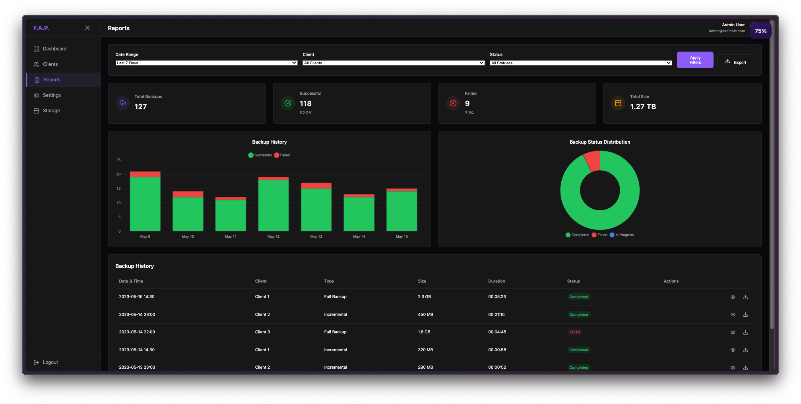

- On peut également obtenir des informations relatives au stockage : 

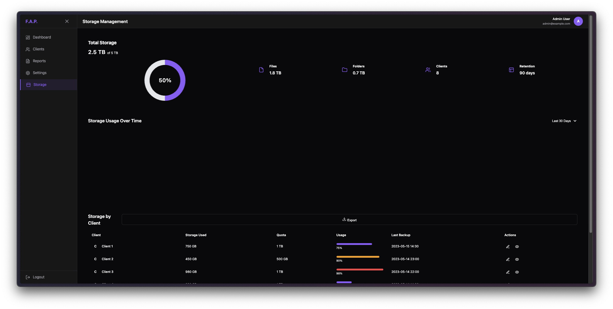

- Et enfin, un menu "réglages" qui permet de modifier le mot de passe admin, de changer l'adresse IP du serveur et de redémarrer le serveur entre autre choses, est également disponible.

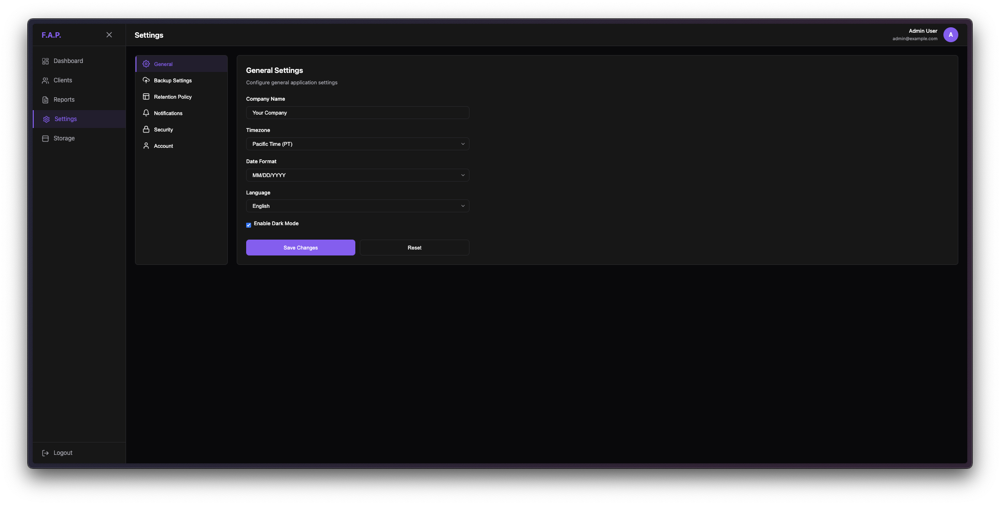

### Panel utilisateur

Le panel utilisateur est accessible via l'URL du client, par exemple "http://client1.sauvegarde.fr".  
Le fonctionnement est assez similaire : 

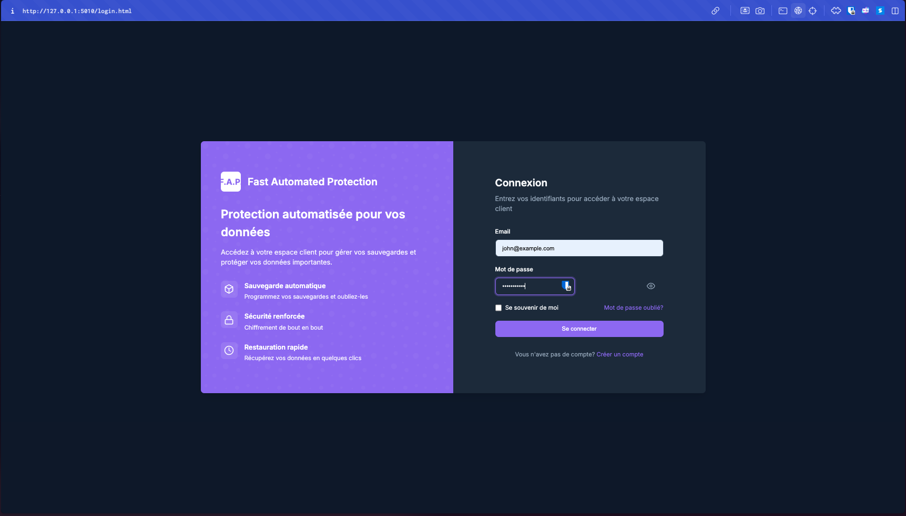

On dispose d'une page de connexion, qui, lors de l'authentification, permet d'accéder à un dashboard:

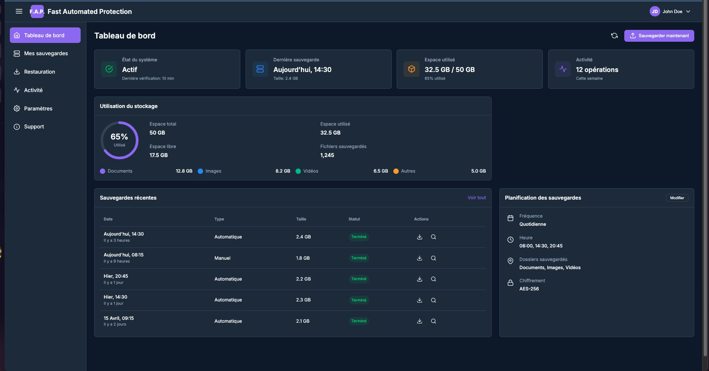

On retrouve les mêmes options que dans le panel admin, mais avec moins de fonctionnalités.

## Considération techniques.

Le fonctionnement de ce projet est à la fois plutôt simple et complexe.  
En effet, il repose sur une architecture de microservices, qui permet de séparer les différentes fonctionnalités du projet.  

Le projet est divisé en plusieurs services, chacun ayant une fonctionnalité spécifique.  
On retrouve donc : 

- La partie admin
- La partie client

Il ne faut pas se tromper, la partie client est n'est pas utilisée dans l'absolu, en tout cas, si elle n'est pas appelée, elle n'est pas utilisée.

### La partie admin

La partie admin est la partie la plus complexe du projet.  
Elle est composée de plusieurs services, chacun ayant une fonctionnalité spécifique.

- Le service de base de données, qui est responsable de la gestion des utilisateurs et des sauvegardes.
- Le service de backend, qui est responsable de la gestion des requêtes API et de la communication avec le service de base de données.
- Le service "Handler", qui permet de lancer des stacks docker via docker-compose.
- Le service Wireguard, qui permet de gérer les connexions VPN et de sécuriser les communications entre les différents services.
- Le service de reverse proxy, qui permet de rediriger les requêtes vers le bon service en fonction de l'URL.

Tous ces services sont à la fois interconnectés, car étant dans les même réseaux lorsque nécessaires, et séparés et cloisonnés.

Ce sont ces mêmes services qui maintiennent la sécurité du projet.  

Lorsqu'un admin a besoin de faire la moindre action, il passe par le panel admin, qui se charge d'envoyer les requêtes aux différents services.  
Ce qui garantit un cloisonnement maximal.

### La partie client

La partie client est là pour "faire joli" si on ne crée pas d'user.  
Tant qu'aucun user n'existe, elle n'a aucun but.

Cela dit, du moment que l'utilisateur est créé, en arrière plan on lance un backend client dédié, ainsi qu'une base de donnée dédiée au client en question.

On a donc deux services (backend admin et backend client) qui sont interconnectés, mais également très séparés pour une meilleure gestion.

### La partie stockage

La partie stockage est gérée par le service de base de données, qui est responsable de la gestion des utilisateurs et des sauvegardes.  
De fait, le stockage est tout simplement un volume docker qui peut être monté ou démonté à la volée.

C'est extrêmement efficace, car ça permet une isolation maximale (de fait, on ne peut pas accéder à un volume docker d'un autre client) et une gestion simplifiée des sauvegardes.
